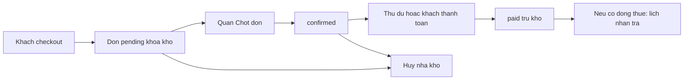

# WebTheThao — ERD, luồng nghiệp vụ, script demo

Một cửa hàng, một MySQL `webthethao`, một ứng dụng Laravel. Schema gốc: `database/migrations/2026_08_22_100000_create_webthethao_schema.php`. Chat: `2026_09_25_100000_create_conversations_and_messages_tables.php`. GHN/MoMo cột đơn: `2026_09_24_100000_add_upgrade_shipping_and_gateway.php`.

Dữ liệu seed là **demo**. Ảnh sản phẩm lưu file `storage/app/public/products`, DB chỉ lưu path.

---

## 1. ERD một schema

### 1.1 Nhóm bảng đang dùng trên website

```mermaid
erDiagram
  users ||--o{ orders : dat
  users ||--o{ payments : thanh_toan
  users ||--o{ rental_bookings : thue
  users ||--o{ reviews : danh_gia
  users ||--o{ notifications : nhan
  users ||--o{ coupon_redemptions : dung_ma
  users ||--o| conversations : chat
  conversations ||--|{ messages : tin

  sports ||--o{ products : mon
  categories ||--o{ products : danh_muc
  products ||--|{ product_variants : bien_the
  product_variants ||--o| inventory_stocks : ton_ban
  product_variants ||--o{ inventory_items : mon_thue

  orders ||--|{ order_items : dong
  orders ||--o{ payments : khoan
  orders ||--o{ inventory_stock_reservations : khoa_ban
  orders ||--o{ inventory_item_reservations : khoa_thue
  orders ||--o{ rental_bookings : lich
  orders ||--o{ reviews : sau_mua
  orders ||--o{ coupon_redemptions : ap_ma

  order_items ||--o| rental_bookings : neu_thue
  order_items ||--o| reviews : mot_review
  products ||--o{ order_items : snapshot
  product_variants ||--o{ order_items : snapshot

  inventory_stocks ||--o{ inventory_stock_reservations : reserve
  inventory_items ||--o{ inventory_item_reservations : reserve
  inventory_items ||--o{ rental_bookings : gan_mon

  rental_bookings ||--o{ rental_extensions : gia_han
  rental_bookings ||--o| rental_returns : tra
  rental_bookings ||--o{ rental_incidents : su_co
  rental_returns ||--o{ rental_incidents : khi_tra

  coupons ||--o{ coupon_redemptions : luot

  users {
    bigint id PK
    string email UK
    enum role "customer staff admin"
    boolean is_active
  }

  sports {
    bigint id PK
    string slug UK
  }

  categories {
    bigint id PK
    string slug UK
    bigint parent_id FK
  }

  products {
    bigint id PK
    bigint category_id FK
    bigint sport_id FK
    enum offer_mode "sale rental both"
    string image_url
  }

  product_variants {
    bigint id PK
    bigint product_id FK
    string sku UK
    decimal sale_price
    decimal rental_price_per_day
    decimal deposit_amount
  }

  inventory_stocks {
    bigint id PK
    bigint product_variant_id FK UK
    int quantity_on_hand
    int quantity_reserved
  }

  inventory_items {
    bigint id PK
    bigint product_variant_id FK
    string asset_code UK
    enum status "available rented inspecting maintenance"
  }

  orders {
    bigint id PK
    bigint user_id FK
    enum channel "online pos"
    enum status "pending confirmed paid processing completed cancelled"
    decimal merchandise_total
    decimal rental_total
    decimal deposit_total
    decimal discount_total
    decimal grand_total
  }

  order_items {
    bigint id PK
    bigint order_id FK
    enum line_type "sale rental"
    bigint product_id FK
    bigint product_variant_id FK
    string product_name
    date rental_start
    date rental_end
    decimal deposit_amount
  }

  inventory_stock_reservations {
    bigint id PK
    bigint inventory_stock_id FK
    bigint order_id FK
    enum status "pending committed released"
  }

  inventory_item_reservations {
    bigint id PK
    bigint inventory_item_id FK
    bigint order_id FK
    date start_date
    date end_date
    enum status "pending committed released"
  }

  rental_bookings {
    bigint id PK
    bigint order_id FK
    bigint order_item_id FK
    bigint inventory_item_id FK
    enum status "pending confirmed active returned overdue cancelled"
  }

  rental_extensions {
    bigint id PK
    bigint rental_booking_id FK
    enum status "pending approved rejected"
  }

  rental_returns {
    bigint id PK
    bigint rental_booking_id FK UK
    bigint staff_user_id FK
    enum condition "good damaged lost"
  }

  rental_incidents {
    bigint id PK
    bigint rental_booking_id FK
    enum type "damage late lost"
    decimal fee_amount
  }

  payments {
    bigint id PK
    bigint order_id FK
    bigint user_id FK
    enum kind "merchandise deposit refund"
    enum method "simulation bank_transfer vnpay momo"
    enum status "pending completed failed cancelled"
  }

  coupons {
    bigint id PK
    string code UK
    enum applies_to "sale rental both"
  }

  coupon_redemptions {
    bigint id PK
    bigint coupon_id FK
    bigint order_id FK
  }

  reviews {
    bigint id PK
    bigint user_id FK
    bigint order_item_id FK
    enum kind "sale rental"
    int rating
  }

  notifications {
    bigint id PK
    bigint user_id FK
    enum type "order_confirmed rental_due_reminder rental_overdue"
  }

  conversations {
    bigint id PK
    bigint user_id FK UK
    string last_message
  }

  messages {
    bigint id PK
    bigint conversation_id FK
    bigint user_id FK
    text body
    timestamp read_at
  }
```

### 1.2 Ý nghĩa khóa chính

| Quan hệ | Ý nghĩa |
| --- | --- |
| `users` 1–n `orders` | Khách sở hữu đơn. Cửa hàng (`staff`/`admin`) không đặt trên storefront. |
| `products.offer_mode` | Cùng catalog: chỉ bán, chỉ thuê, hoặc cả hai. |
| `product_variants` 1–1 `inventory_stocks` | Tồn bán theo số lượng. |
| `product_variants` 1–n `inventory_items` | Mỗi món thuê có `asset_code`. |
| `orders` 1–n `order_items` | Giỏ hỗn hợp: dòng `sale` và `rental` trên một đơn. Dòng lưu snapshot tên/SKU/giá. |
| `orders` 1–n `payments` | Tách **tiền hàng** (`merchandise` = bán + thuê − giảm) và **cọc** (`deposit`). |
| `rental_bookings` | Một dòng thuê → một lịch, gắn một `inventory_item`. |
| `users` 1–1 `conversations` | Chat cửa hàng ↔ khách; `messages` thuộc một thread. |

### 1.3 Bảng dự trữ — có trong DB, chưa dùng trên UI

Không demo, không kể như chức năng đang chạy:

- `user_addresses` — sổ địa chỉ (checkout ghi thẳng lên `orders.shipping_*`).
- `membership_plans`, `memberships` — hội viên.
- `media_files` — thư viện media (ảnh đang là path trên `products`).
- `password_reset_tokens` — chuẩn Laravel, chưa làm form quên mật khẩu.

---

## 2. Luồng nghiệp vụ

### 2.1 Tài khoản

- Đăng ký website → chỉ `customer`.
- Cửa hàng do quản trị tạo: `staff` (chốt đơn, kho, thuê) và `admin` (thêm người dùng, mã giảm, báo cáo).

### 2.2 Luồng bán

1. Khách mở sản phẩm `offer_mode` = sale hoặc both, chọn variant, thêm giỏ (`line_type` = sale).
2. Checkout: tạo `orders` **pending**, khóa `inventory_stock_reservations` (tăng `quantity_reserved`).
3. Tạo khoản `payments.kind` = merchandise (sau giảm giá nếu có coupon).
4. Quán **Chốt đơn** → `confirmed`.
5. Thu tiền (khách giả lập, hoặc nhân viên xác nhận chuyển khoản / **Thu đủ**).
6. Đủ khoản collectible và đơn đã chốt → `paid`, reservation **committed**, trừ `quantity_on_hand`.

Hủy khi `pending` hoặc `confirmed` (chưa thanh toán xong): nhả reserve, hủy khoản pending.

### 2.3 Luồng thuê

1. Khách chọn ngày nhận/trả, xem báo giá (ngày/tuần + cọc), thêm giỏ (`line_type` = rental).
2. Cùng checkout với dòng bán (giỏ hỗn hợp).
3. Hệ thống khóa một `inventory_item` trống trong khoảng ngày (`inventory_item_reservations`) và tạo `rental_bookings` (pending).
4. Tạo thêm khoản `payments.kind` = deposit (cọc), tách khỏi tiền thuê (nằm trong merchandise/rental của đơn).
5. Quán chốt đơn như luồng bán.
6. Sau `paid`: nhân viên trên **Lịch thuê** xác nhận → nhận đồ (`active`) → trả (`returned`) / trễ (`overdue`). Có gia hạn (`rental_extensions`) và sự cố (`rental_incidents`).

Mã giảm (`SALE10`, …) chỉ trừ **tiền hàng + tiền thuê**, không trừ cọc.

### 2.5 Bán tại quầy

Nhân viên / quản trị mở **Quản trị → Bán tại quầy**: màn hình quầy (danh mục, thẻ sản phẩm, nhiều tab đơn). Chọn khách có tài khoản (**Tìm khách**) hoặc để trống tên = **Khách lẻ**. **Thanh toán** = lập đơn `channel=pos` và thu đủ (`paid`). **Lưu đơn** = cùng kênh POS nhưng `pending` (chưa thu). Không dùng giỏ website của khách.

### 2.4 Quán chốt đơn



Trạng thái đơn: `pending` → `confirmed` → `paid` → `processing` → `completed`. Hủy từ `pending` hoặc `confirmed`.

- Checkout **không** tự chốt. Email / thông báo: đã nhận đơn, chờ cửa hàng xác nhận.
- **Chốt đơn:** `pending` → `confirmed`. Nếu đã thu đủ thì ngay sau đó → `paid`.
- **Thu đủ:** nếu còn `pending` thì chốt rồi mới ghi nhận tiền và trừ kho.

---

## 3. Script demo tay (10–15 phút)

URL: [http://localhost/WebTheThao/public](http://localhost/WebTheThao/public)

Mọi mật khẩu seed: `password`.

| Vai trò | Email |
| --- | --- |
| Khách | `khach@webthethao.test` |
| Nhân viên | `nhanvien@webthethao.test` |
| Quản trị / cửa hàng trưởng | `admin@webthethao.test` |

### Bước 1 — Khách đặt (khoảng 5 phút)

1. Đăng nhập khách.
2. Mở một sản phẩm **Mua** (ví dụ Giày Copa), thêm giỏ.
3. Mở sản phẩm **Thuê** (ví dụ vợt), chọn ngày nhận/trả, thêm giỏ.
4. (Tuỳ) Thanh toán: nhập mã `SALE10`.
5. Đặt hàng. Đơn hiện **Chờ chốt**. Kho đã khóa.

### Bước 2 — Nhân viên chốt (khoảng 4 phút)

1. Đăng xuất, đăng nhập nhân viên → vào Quản trị.
2. **Đơn hàng** → nút **Chờ chốt** (nếu có) → mở đơn vừa đặt.
3. Bấm **Chốt đơn**. Nếu khách chưa trả: **Thu đủ** hoặc xác nhận từng khoản thanh toán.
4. (Tuỳ) **Hủy đơn** trên đơn khác để thấy kho được nhả.
5. Menu **không** có Người dùng / Mã giảm / Báo cáo.

### Bước 3 — Quản trị (khoảng 3 phút)

1. Đăng nhập `admin@webthethao.test`.
2. **Người dùng:** thấy khách / nhân viên / quản trị; nút thêm tài khoản cửa hàng.
3. **Báo cáo:** lọc ngày, doanh thu.
4. (Tuỳ) **Lịch thuê:** xác nhận / trả đồ nếu đơn có dòng thuê và đã `paid`.
5. (Tuỳ) **Tin nhắn:** mở hội thoại khách, trả lời.

### Checklist nhanh

- [ ] Khách không vào `/admin`.
- [ ] Nhân viên không vào `/admin/users`, `/admin/coupons`, `/admin/reports`.
- [ ] Đơn sau checkout là Chờ chốt, không tự Đã chốt.
- [ ] Hai khoản thanh toán khi giỏ có cả mua và thuê (hàng + cọc).
